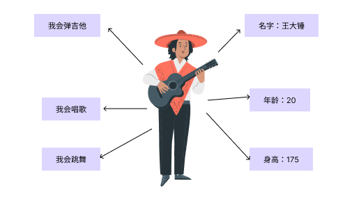
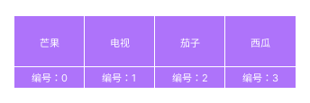

[TOC]

## 变量

变量是存储值的容器。要声明一个变量，先输入关键字 `let` 或 `var`，然后输入合适的名称：

```javascript
let myVariable; //块级作用域变量
var myVariable; //没有块级作用域
```

什么是块级作用域

```javascript
//花括号包裹的地方视为一块区域，使用let声明则外部无法读取，也叫局部变量。
{
    let b = 3
    var a = 4
}
console.log(b) //无法反问
console.log(a) //4--->可以访问
```

```javascript
//赋值
myVariable = '李雷';
```

## 常量

常量的值是无法（通过重新赋值）改变的，也不能被重新声明。

```javascript
const URL = 1;
URL = 2 //报错 Uncaught TypeError: Assignment to constant variable.at
```

## 数据类型

| 变量    | 解释                                                         | 示例                                                         |
| ------- | ------------------------------------------------------------ | ------------------------------------------------------------ |
| String  | 字符串（一串文本）：字符串的值必须用引号（单双均可，必须成对）扩起来。 | `let myVariable = '李雷';`                                   |
| Number  | 数字：无需引号。                                             | `let myVariable = 10;`                                       |
| Boolean | 布尔值（真 / 假）： `true`/`false` 是 JS 里的特殊关键字，无需引号。 | `let myVariable = true;`                                     |
| Array   | 数组：用于在单一引用中存储多个值的结构。                     | `let myVariable = [1, '李雷', '韩梅梅', 10];` 元素引用方法：`myVariable[0]`, `myVariable[1]` |
| object  | 对象：JavaScript 里一切皆对象，一切皆可储存在变量里。这一点要牢记于心。 | `let myVariable = document.querySelector('h1');`以及上面所有示例都是对象。 |

## 运算符

可以根据两个值（或变量）产生结果。以下表格中介绍了一些最简单的运算符，可以在浏览器控制台里尝试一下后面的示例。

| 运算符         | 解释                                                         | 符号          | 示例                                                         |
| -------------- | ------------------------------------------------------------ | ------------- | ------------------------------------------------------------ |
| **加**         | 将两个数字相加，或拼接两个字符串。                           | `+`           | `6 + 9;`<br/>`"Hello " + "world!";`                          |
| **减、乘、除** | 这些运算符操作与基础算术一致。只是乘法写作星号，除法写作斜杠。 | `-`,` *`,` /` | **`9 - 3;`<br/>`8 * 2; //乘法在JS中是一个星号`<br/>`9 / 3;`** |
| **赋值运算符** | 为变量赋值（你之前已经见过这个符号了）                       | `=`           | `let myVariable = '李雷';`                                   |
| **等于**       | 测试两个值是否相等，并返回一个 `true`/`false` （布尔）值。   | `===`         | `let myVariable = 3;`<br/>`myVariable === 4; // false`       |
| **不等于**     | 和等于运算符相反，测试两个值是否不相等，并返回一个 `true`/`false` （布尔）值。 | `!==`         | `let myVariable = 3;`<br/>`myVariable !== 3; // false`       |
| **取非**       | 返回逻辑相反的值，比如当前值为真，则返回 `false`。           | `!`           | 原式为真，但经取非后值为 `false`：<br/>`let myVariable = 3;!(myVariable === 3); // false` |

## 条件语句

条件语句是一种代码结构，用来测试表达式的真假，并根据测试结果运行不同的代码。一个常用的条件语句是 `if ... else`。下面是一个示例：

```javascript
let iceCream = 'chocolate';
if (iceCream === 'chocolate') {
  alert('我最喜欢巧克力冰激淋了。');
} else {
  alert('但是巧克力才是我的最爱呀……');
}
```

`if ( ... )` 中的表达式进行测试，用（上文所提到的）等于运算符来比较变量 `iceCream` 与字符串 `'chocolate'` 是否相等。如果返回 `true`，则运行第一个代码块；如果返回 `false`，则跳过第一块直接运行 `else` 之后的第二个代码块。

**switch语句**

当`key`值与`case`中的值匹配则执行下方子语句，直到语句执行完成或者遇到`break`停止。

> 如果没有`break`语句后方的匹配则失效继续执行下方代码

```JavaScript
switch (key) {
    case '小猫':
		//当key值与case中的值匹配则执行下方子语句，直到遇到break停止。
         console.log('key值与小猫相匹配')
        break;
    case '小狗':
        
        console.log('key值与小狗相匹配')
        break;
    case '小鱼':
  
        console.log('key值与小鱼相匹配')
        break;
    default: //default上方没有匹配的语句则执行default中的子语句
        console.log('上方谁都不匹配')
        break;
}
```


## 循环语句

```JavaScript
for (初始化器; 退出条件; 最终条件) {
  //循环体-重复执行的代码块
}
```

1. 在括号内，我们有三个项目，以分号分隔：
   1. 一个**初始化器** - 这通常是一个设置为一个数字的变量，它被递增来计算循环运行的次数。它也有时被称为**计数变量**。
   2. 一个**退出条件** - 如前面提到的，这个定义循环何时停止循环。这通常是一个表现为比较运算符的表达式，用于查看退出条件是否已满足的测试。
   3. 一个**最终条件** - 这总是被判断（或运行），每个循环已经通过一个完整的迭代消失时间。它通常用于增加（或在某些情况下递减）计数器变量，使其更接近退出条件值。

## 函数

**函数**用来封装可复用的功能。如果没有函数，一段特定的操作过程用几次就要重复写几次，而使用函数则只需写下函数名和一些简短的信息。

```javascript
//基本语法
function 函数名称(参数1，参数2) {
  return '函数返回值';
}
//函数调用
函数名称(传递的参数)
//匿名函数
function (){
    return '返回'
}
```

## 对象



在 JavaScript 中，几乎所有的对象都是 `Object` 类型的实例

```javascript
//声明对象
let o = new Object();
//声明对象
let o  = {
    name:'王大锤',
    age:20,
    height:175,
    guitar:function(song){
         console.log('弹一首：'+song)
    },
    sing:function(song){
         console.log('给老板演唱一首：'+song)
    },
    dance:function(dance){
         console.log('跳一段：'+dance)
    }
}
//老板：王大锤给我来首月亮放的罪
//王大锤：好的
o.sing('月亮放的罪')//给老板演唱一首：月亮放的罪
```

## 数组



数组由方括号构成，其中包含用逗号分隔的元素列表。

1、假设我们想在一个数组中存储一个购物清单 - 我们会做一些像下面这样的事情。在您的控制台中输入以

```javascript
let shopping = ['芒果', '电视', '茄子', '西瓜'];
shopping;
```

## DOM

文档对象模型 (DOM) 是 `HTML` 和` XML `文档的编程接口。它提供了对文档的结构化的表述，并定义了一种方式可以使从程序中对该结构进行访问，从而改变文档的结构，样式和内容。DOM 将文档解析为一个由节点和对象（包含属性和方法的对象）组成的结构集合。简言之，它会将 web 页面和脚本或程序语言连接起来。

**`DOM` 中核心接口**

- `document.getElementById(id)`    根据节点`ID`获取节点**元素**`element`

- `document.querySelector('html')`可以是`ID`也可以是**类名**

- `document.getElementsByTagName(name)`    根据节点`name`获取节点**列表**`nodeList`

- `document.createElement(name)`     创建一个节点（节点名称）`div`   `span` `ul`  `li` 等等...

- `parentNode.appendChild(node)`    向节点中插入一个子节点-（节点**元素**）`element`

- `element.innerHTML`   向节点中插入一段`html`文本

- `element.style.left`    设置元素`style`样式中的`left`属性值

- `element.setAttribute(name, value)`  设置元素属性与值

- `element.getAttribute(name)`  获取**元素**属性**值**

- `element.addEventListener(事件的名称, 事件触发回调, 其他配置)`  事件绑定函数-

- `window.onload`  页面加载后执行

**获取页面上DOM元素**

```javascript
let elementDiv = document.getElementById('div')
elementDiv.innerHTML = '<h1>吧H1插入到div中</h1>'
```


## 事件

事件能为网页添加真实的交互能力。它可以捕捉浏览器操作并运行一些代码做为响应。最简单的事件是 [点击事件](https://developer.mozilla.org/zh-CN/docs/Web/API/Element/click_event)，鼠标的点击操作会触发该事件。可尝试将下面的代码输入到控制台，然后点击页面的任意位置：

```javascript
document.querySelector('html').onclick = function() {
    alert('别戳我，我怕疼。');
}
```

将事件与元素绑定有许多方法。在这里选用了`html` 元素，把一个匿名函数（就是没有命名的函数，这里的匿名函数包含单击鼠标时要运行的代码）赋值给了 `html` 的 `onclick (en-US)` 属性。

- 鼠标点击
- 鼠标经过
- 键盘按下
- 等等...

## 内置对象

- `Math`
- `Array`
- `Date`
- 等等...

**举例**：`Math`

> **`Math`** 是一个内置对象，它拥有一些数学常数属性和数学函数方法。`Math` 不是一个函数对象。

**`Math`**中的方法：**`Math.random()`**

**`Math.random()`** 函数返回一个浮点数， 伪随机数在范围从**0 到**小于**1**，也就是说，从 0（包括 0）往上，但是不包括 1（排除 1），然后您可以缩放到所需的范围。实现将初始种子选择到随机数生成算法;它不能被用户选择或重置。

```javascript
console.log(Math.random()) //0.19614555327546457
```

**`Math`**中的方法：**`Math.floor()`**

向下取整

```javascript
Math.floor( 45.95);
// 45
Math.floor( 45.05);
// 45
Math.floor( 4 );
// 4
Math.floor(-45.05);
// -46
Math.floor(-45.95);
// -46
```

原文：https://developer.mozilla.org/zh-CN/docs/Web/JavaScript
